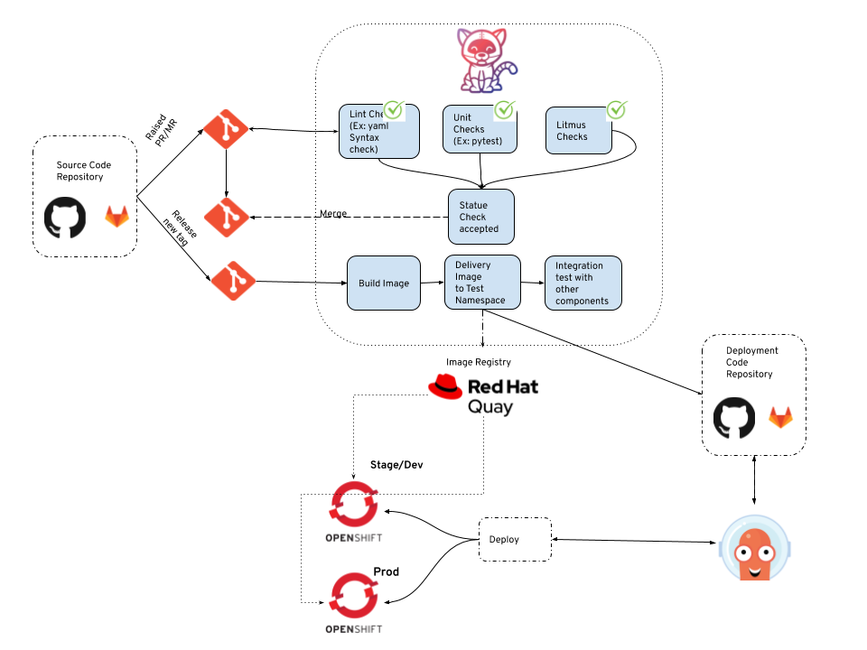

# (Opinionated) Continuous Delivery

With "Operate First: Continous Delivery" we seek to describe an opinionated continous delivery concept, show its
implementation and operation. We want to improve the capacity of cloud native developers and operators to deliver
software artifacts faster and with less friction.

We focus on the OpenShift Container Platform and its capabilities to run open hybride cloud workloads.

We use OpenShift Pipeline (or the coresponding Tekton release) to deploy a Continous Integration and Continious Delivery
system that:

* delivers Python Module Artifacts to pypi.org
* delivers Container Image to [quay.io](https://quay.io/).
* introduces changes to GitOps repositories on github.com

Any pipeline or task declaration is published as open-source software, and operational documentation is published on
our website.

## Architecture

## Services and Features

- Status Check on Pull Requests for testing and containerization.

  - `aicoe-ci/pre-commit-check` execute [pre-commit](https://pre-commit.com/) checks based on [pre-commit-config.yaml](.pre-commit-config.yaml).
  - `aicoe-ci/pytest-check` executes run python test.
  - `aicoe-ci/build-check` execute container image build check. Supports source-to-image, Dockerfile, Containerfile based image.

- Building Container image on Tag release and for Pull Requests.

  - On Tag release, the pipeline would build a container image based upon the tag and delivers it to [quay.io](https://quay.io/).
  - Pull Request based image can be build by commenting `/deploy` on a pull request comment to release an image to [quay.io](https://quay.io/).
